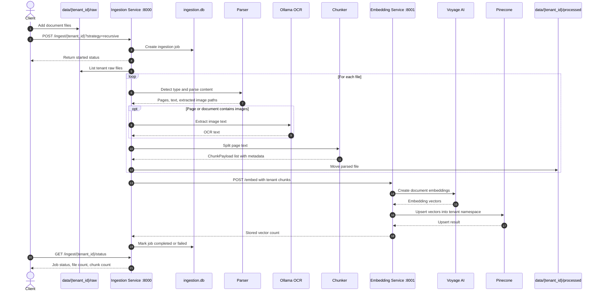
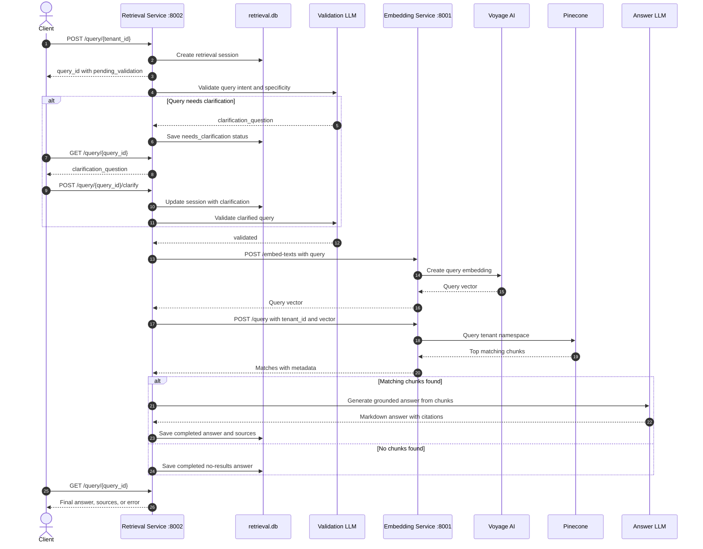

# Multi-Tenant RAG as a Service

A Python/FastAPI implementation of a multi-tenant Retrieval-Augmented Generation
(RAG) system. The project is split into three services:

- **Ingestion Service**: watches tenant folders, parses uploaded documents, extracts
  OCR text from images, chunks content, and sends chunks for embedding.
- **Embedding Service**: creates embeddings with Voyage AI and stores vectors in
  Pinecone, using one Pinecone namespace per tenant.
- **Retrieval Service**: validates user questions, retrieves relevant chunks, and
  generates grounded answers with source citations.

## Architecture

```text
data/{tenant_id}/raw
        |
        v
Ingestion Service :8000
  - PDF/DOCX/TXT/image parsing
  - image extraction + OCR
  - recursive or semantic chunking
        |
        v
Embedding Service :8001
  - Voyage AI embeddings
  - Pinecone upsert/query
        |
        v
Pinecone index
  - namespace = tenant_id
        ^
        |
Retrieval Service :8002
  - query validation
  - vector retrieval
  - LLM answer generation
```

```mermaid
flowchart LR
    User["User / Client"]
    TenantRaw["data/{tenant_id}/raw"]
    TenantProcessed["data/{tenant_id}/processed"]
    Ingestion["Ingestion Service\nFastAPI :8000"]
    Parser["Document Parser\nPDF / DOCX / TXT / Image"]
    OCR["OCR\nOllama glm-ocr"]
    Chunker["Chunker\nRecursive / Semantic"]
    Embedding["Embedding Service\nFastAPI :8001"]
    Voyage["Voyage AI\nvoyage-3.5"]
    Pinecone["Pinecone Index\nnamespace = tenant_id"]
    Retrieval["Retrieval Service\nFastAPI :8002"]
    Validator["Query Validator\nLLM"]
    AnswerLLM["Answer Generator\nLLM"]
    IngestionDB["ingestion.db\nSQLite"]
    RetrievalDB["retrieval.db\nSQLite"]

    User -->|Place files| TenantRaw
    User -->|POST /ingest/{tenant_id}| Ingestion
    Ingestion --> IngestionDB
    Ingestion --> TenantRaw
    Ingestion --> Parser
    Parser --> OCR
    Parser --> Chunker
    OCR --> Chunker
    Chunker -->|POST /embed| Embedding
    Embedding --> Voyage
    Voyage --> Embedding
    Embedding -->|Upsert vectors| Pinecone
    Ingestion -->|Move processed files| TenantProcessed

    User -->|POST /query/{tenant_id}| Retrieval
    Retrieval --> RetrievalDB
    Retrieval --> Validator
    Validator -->|Validated| Embedding
    Validator -->|Needs clarification| User
    Embedding -->|Embed query| Voyage
    Embedding -->|Query namespace| Pinecone
    Pinecone --> Embedding
    Embedding --> Retrieval
    Retrieval --> AnswerLLM
    AnswerLLM --> Retrieval
    Retrieval -->|Answer + sources| User
```

## Ingestion Flow



## Retrieval Flow



## Repository Layout

```text
.
|-- data/                    # Tenant document folders
|   `-- {tenant_id}/
|       |-- raw/             # Place files here before ingestion
|       `-- processed/       # Ingested files are moved here
|-- embedding-service/       # Embedding and Pinecone vector service
|-- ingestion-service/       # Document ingestion, parsing, OCR, chunking
|-- retrieval-service/       # Query validation, retrieval, answer generation
|-- shared/                  # Shared Pydantic models
|-- ingestion.db             # SQLite ingestion job database
|-- retrieval.db             # SQLite retrieval session database
`-- test.py                  # Small local Ollama embedding test
```

## Features

- Multi-tenant ingestion and retrieval through tenant IDs.
- Tenant isolation through Pinecone namespaces.
- Supported input types: PDF, DOCX, TXT, PNG, JPG, JPEG, GIF, BMP, TIFF, and WEBP.
- PDF and DOCX image extraction.
- OCR through an Ollama vision model.
- Recursive chunking by default, with optional semantic chunking.
- Background ingestion jobs with status tracking.
- Query clarification flow for vague or underspecified questions.
- Source-aware answers that cite filenames and page numbers.
- LangSmith tracing hooks in embedding and retrieval flows.

## Prerequisites

- Python 3.12 or compatible Python 3.x runtime.
- Pinecone account and API key.
- Voyage AI API key.
- A LiteLLM/OpenAI-compatible chat endpoint for retrieval generation.
- Ollama if you want local OCR or semantic chunking.

The code expects these Ollama models when those paths are used:

```powershell
ollama pull glm-ocr:latest
ollama pull nomic-embed-text:latest
```

## Environment Variables

Create a `.env` file in the project root. Do not commit real secrets.

```env
# Retrieval LLM endpoint
LITELLM_API_BASE=http://127.0.0.1:11434/v1
LITELLM_API_KEY=ollama
VALIDATION_MODEL=ministral-3:latest
ANSWER_MODEL=ministral-3:latest

# Optional LangSmith tracing
LANGCHAIN_TRACING_V2=false
LANGCHAIN_API_KEY=

# Embeddings and vector storage
VOYAGE_API_KEY=your-voyage-api-key
PINECONE_API_KEY=your-pinecone-api-key
PINECONE_INDEX=multi-tenant-rag
PINECONE_CLOUD=aws
PINECONE_REGION=us-east-1

# Service URLs
EMBEDDING_SERVICE_URL=http://localhost:8001

# Local storage
DATA_DIR=C:\personal\Multi-tenant-Rag-as-a-Service\data
OLLAMA_HOST=http://localhost:11434
```

Notes:

- `VALIDATION_MODEL` and `ANSWER_MODEL` are used by the retrieval service. If they
  are not set, both default to `ministral-3:latest`.
- `DATA_DIR` defaults to `/data` in the code, so set it explicitly for local
  Windows development.
- Both ingestion and retrieval database modules read `DB_PATH` if provided. If you
  set it globally, both services will use the same SQLite file. Leaving it unset
  uses `./ingestion.db` for ingestion and `./retrieval.db` for retrieval.

## Installation

From the project root:

```powershell
python -m venv venv
.\venv\Scripts\Activate.ps1
python -m pip install --upgrade pip
```

Install the service dependencies:

```powershell
pip install -r ingestion-service\requirements.txt
pip install -r embedding-service\requirements.txt
pip install -r retrieval-service\requirements.txt
```

## Running the Services

Run each service in a separate terminal from the project root.

```powershell
.\venv\Scripts\Activate.ps1
python -m uvicorn embedding-service.main:app --host 0.0.0.0 --port 8001
```

```powershell
.\venv\Scripts\Activate.ps1
python -m uvicorn ingestion-service.main:app --host 0.0.0.0 --port 8000
```

```powershell
.\venv\Scripts\Activate.ps1
python -m uvicorn retrieval-service.main:app --host 0.0.0.0 --port 8002
```

Health checks:

```powershell
curl http://localhost:8000/health
curl http://localhost:8001/health
curl http://localhost:8002/health
```

## Data Layout

Each tenant gets its own folder under `DATA_DIR`:

```text
data/
`-- acme-corp/
    |-- raw/
    `-- processed/
```

Place documents into `data/{tenant_id}/raw/`, then start an ingestion job. After a
file is parsed successfully, it is moved to `data/{tenant_id}/processed/`.

## API Usage

### 1. Start Ingestion

```powershell
curl -X POST "http://localhost:8000/ingest/acme-corp?strategy=recursive"
```

Optional query parameters:

- `strategy=recursive`: character-based recursive chunking.
- `strategy=semantic`: semantic chunking with Ollama embeddings.
- `custom_tags=tag-value`: attaches a simple custom tag to chunk metadata.

### 2. Check Ingestion Status

```powershell
curl http://localhost:8000/ingest/acme-corp/status
```

Example response:

```json
{
  "tenant_id": "acme-corp",
  "status": "completed",
  "started_at": "2026-05-27 08:10:00",
  "completed_at": "2026-05-27 08:10:20",
  "error_message": null,
  "file_count": 2,
  "chunk_count": 14
}
```

### 3. Submit a Query

```powershell
curl -X POST http://localhost:8002/query/acme-corp `
  -H "Content-Type: application/json" `
  -d "{\"query\":\"What does the resume say about Python experience?\"}"
```

The response includes a `query_id`. The retrieval pipeline runs in the
background.

```json
{
  "query_id": "generated-query-id",
  "status": "pending_validation",
  "answer": null,
  "clarification_question": null,
  "sources": null,
  "error_message": null
}
```

### 4. Poll Query Status

```powershell
curl http://localhost:8002/query/generated-query-id
```

Completed responses include an answer and source filenames:

```json
{
  "query_id": "generated-query-id",
  "status": "completed",
  "answer": "The answer in markdown...",
  "clarification_question": null,
  "sources": ["Mannresumetailored.pdf"],
  "error_message": null
}
```

### 5. Answer a Clarification Request

If a query is vague, the retrieval service can return
`status=needs_clarification` with a clarification question.

```powershell
curl -X POST http://localhost:8002/query/generated-query-id/clarify `
  -H "Content-Type: application/json" `
  -d "{\"clarification\":\"Focus on the candidate's backend Python projects.\"}"
```

## Service Endpoints

### Ingestion Service `:8000`

- `POST /ingest/{tenant_id}`: start background ingestion.
- `GET /ingest/{tenant_id}/status`: read latest ingestion job status.
- `GET /health`: health check.

### Embedding Service `:8001`

- `POST /embed`: embed document chunks and upsert to Pinecone.
- `POST /embed-texts`: embed raw text only, used for query vectors.
- `POST /query`: query a tenant namespace in Pinecone.
- `GET /health`: health check.

### Retrieval Service `:8002`

- `POST /query/{tenant_id}`: submit a user query.
- `GET /query/{query_id}`: poll query status or result.
- `POST /query/{query_id}/clarify`: continue a query that needs clarification.
- `GET /health`: health check.

## How Tenant Isolation Works

The embedding service stores all vectors in the configured Pinecone index, but
uses the tenant ID as the Pinecone namespace:

```text
Pinecone index: multi-tenant-rag
namespace: acme-corp
namespace: tenant_2
namespace: ...
```

Retrieval queries always include the `tenant_id`, so they search only that
tenant's namespace.

## Implementation Notes

- `shared/models.py` contains the shared Pydantic request, response, metadata,
  ingestion, and query status models.
- Ingestion jobs are tracked in SQLite through `ingestion.db`.
- Retrieval sessions are tracked in SQLite through `retrieval.db`.
- Pinecone vectors use Voyage `voyage-3.5` embeddings with dimension `1024`.
- Retrieved chunk metadata includes filename, page number, document type, chunk
  index, timestamp, optional custom tags, and optional source image paths.
- The retrieval pipeline validates the query first. Valid queries proceed to
  vector retrieval and answer generation; vague queries stop with a clarification
  prompt.

## Troubleshooting

- **`Directory not found: .../raw`**: create `data/{tenant_id}/raw` before calling
  ingestion.
- **Embedding failures**: check `VOYAGE_API_KEY` and that the embedding service is
  running on `EMBEDDING_SERVICE_URL`.
- **Pinecone upsert/query failures**: check `PINECONE_API_KEY`, region, cloud, and
  index name.
- **OCR failures**: make sure Ollama is running and `glm-ocr:latest` is available.
- **Semantic chunking failures**: make sure Ollama is running and
  `nomic-embed-text:latest` is available.
- **Retrieval LLM failures**: check `LITELLM_API_BASE`, `LITELLM_API_KEY`,
  `VALIDATION_MODEL`, and `ANSWER_MODEL`.

## Development Notes

The existing `.gitignore` excludes:

```text
venv
__pycache__
.env
```

Consider also excluding local SQLite databases and tenant data if they should not
be committed:

```text
*.db
data/
```
